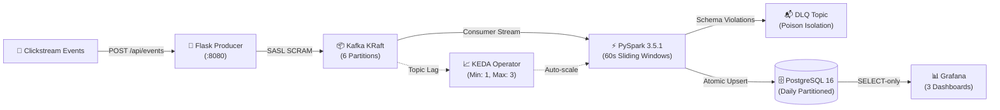

# K.S.C.E.P. Platform
### Kubernetes Stream Clickstream Event Processing

[](https://opensource.org/licenses/Apache-2.0)
[](https://kubernetes.io/)
[](https://kafka.apache.org/)
[](https://spark.apache.org/)
[](https://www.postgresql.org/)
[](https://keda.sh/)
[](https://grafana.com/)
[](https://www.terraform.io/)

An enterprise-grade, real-time event streaming and analytical processing platform running entirely on Kubernetes. Designed following GitOps, Zero-Trust network segmentation, and Infrastructure-as-Code best practices.

---

## 🏗️ Architecture



---

## 🚀 Key Features

- **Schema Governance:** Incoming clickstream events are validated against strict JSON Schema v1 (`schemas/event_v1.json`) before broker ingestion.
- **Kafka KRaft Architecture:** SASL SCRAM-SHA-512 authenticated Apache Kafka operating without ZooKeeper for faster consensus and lower footprint.
- **Stream Processing & DLQ:** PySpark Structured Streaming computes 60-second window metrics with 2-minute event watermarking and isolates bad records to a Dead Letter Queue.
- **Idempotent Storage:** Analytical metrics upserted atomically (`ON CONFLICT DO UPDATE`) into daily partitioned PostgreSQL 16 tables.
- **Event-Driven Autoscaling:** KEDA monitors Kafka consumer group lag and proactively scales pods before message backpressure degrades latency.
- **Zero-Trust Network Policies:** `default-deny-all` enforced across all namespaces with explicit, fine-grained ingress/egress rules.
- **Unified Observability:** Prometheus metric scraping, Alertmanager rules, Loki log aggregator, and 3 pre-provisioned Grafana dashboards as code (`Executive`, `Engineering`, `Infra/Ops`).

---

## ⚡ Quickstart

### 1. Prerequisites
- Docker Desktop or Minikube
- [Terraform >= 1.5.0](https://www.terraform.io/downloads)
- [kubectl](https://kubernetes.io/docs/tasks/tools/)

### 2. Start Cluster & Deploy
```bash
# Start Minikube with sufficient memory
minikube start --cpus=2 --memory=4096mb --driver=docker

# Deploy infrastructure via Terraform
cd terraform/envs/dev
terraform init
terraform apply -auto-approve
```

### 3. Access UIs
- **Producer Simulator UI (`http://localhost:8080`):**
  ```bash
  kubectl port-forward svc/producer -n clickstream-pipeline 8080:8080
  ```
- **Grafana Dashboards (`http://localhost:3000` - User: `admin`):**
  ```bash
  kubectl port-forward svc/grafana -n monitoring 3000:3000
  ```
  *Retrieve passwords from Kubernetes Secrets:*
  ```bash
  # Grafana admin password
  kubectl get secret grafana-secrets -n monitoring -o jsonpath="{.data.admin-password}" | base64 -d
  # Producer admin API key
  kubectl get secret producer-secrets -n clickstream-pipeline -o jsonpath="{.data.admin-api-key}" | base64 -d
  ```

---

## 🧪 Testing Suite

- **Unit & Schema Tests:**
  ```bash
  pytest tests/unit/ tests/integration/ -v
  ```
- **High-Concurrency Load Testing:**
  ```bash
  kubectl apply -f tests/load/k8s-locust-job.yaml
  ```
- **Security & Vulnerability Audits:**
  ```bash
  ./scripts/security/run_security_scans.sh
  ```

---

## 📁 Repository Structure

```text
├── .github/workflows/    # CI/CD pipelines (Lint, Test, Security, Terraform)
├── docs/                 # PRD, SRD, Tech Stack, Security Report, Runbooks
├── producer/             # Flask Ingestion API & Traffic Simulator
├── schemas/              # JSON Schema definitions (event_v1.json)
├── security/             # CIS kube-bench benchmark manifests
├── spark/                # PySpark Structured Streaming job & Dockerfile
├── terraform/            # Reusable IaC modules & dev environment
└── tests/                # Unit, integration, and Locust load tests
```

---

## 📄 Documentation

- [Product Requirements Document (PRD)](docs/prd.md)
- [System Architecture](docs/architecture.md)
- [Security & Compliance Report](docs/security_compliance_report.md)
- [Interview & Presentation Guide](docs/interview_presentation_guide.md)
- [Disaster Recovery Runbook](docs/runbooks/disaster_recovery.md)

---

## 📜 License
 
This project is licensed under the Apache License 2.0 - see the [LICENSE](LICENSE) file for details.
