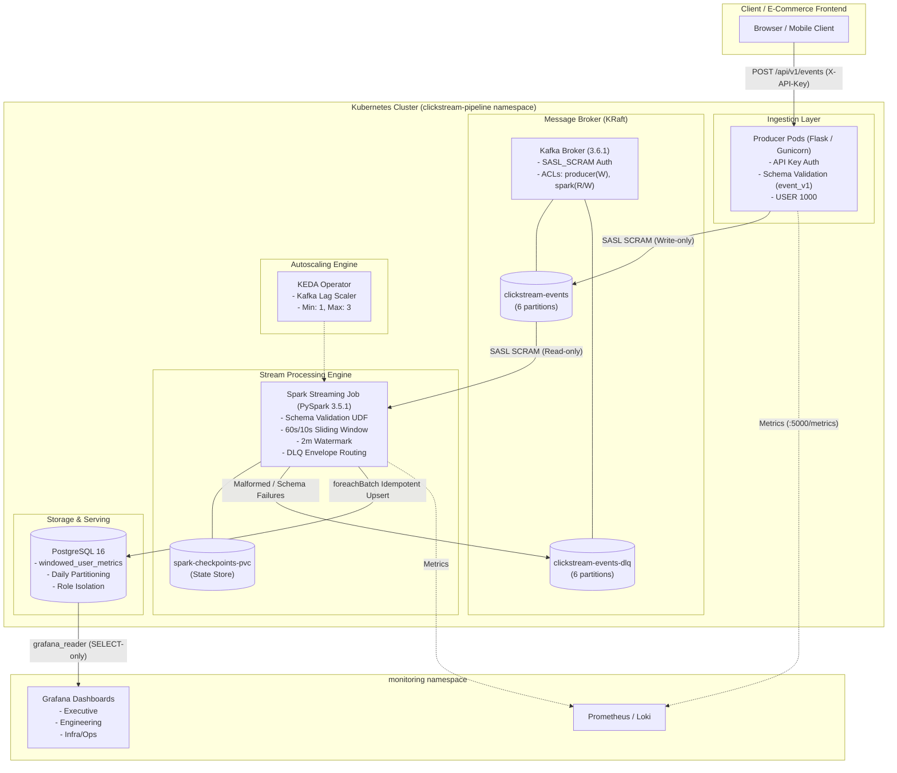

# System Architecture & Data Flow

## Project: K.S.C.E.P. Platform

---

### 1. High-Level Architecture Diagram



---

### 2. End-to-End Data Pipeline Flow

#### Step 1: Event Generation & Boundary Ingestion
1. Client generates interaction events (`page_view`, `cart_add`, `purchase`, `page_exit`).
2. Event is transmitted via HTTP POST to the Flask Producer service with an `X-API-Key` header.
3. The Producer service validates the payload against `schemas/event_v1.json`:
   - If invalid: rejects immediately with HTTP 400 and validation error message.
   - If valid: serializes to JSON and produces message to Kafka topic `clickstream-events` with partition key `user_id`.

#### Step 2: Stream Consumption & Spark Validation
1. The Spark Streaming container boots as user `spark` (UID 1000) and reads from `clickstream-events` using `SASL_PLAINTEXT` and `SCRAM-SHA-512`.
2. A schema validation UDF verifies the raw Kafka value:
   - **Valid Events:** Passed down the analytics pipeline.
   - **Invalid / Poison Pills:** Wrapped into a standardized Dead-Letter Queue envelope (`dlq_envelope.json`) containing error details, original payload, source partition, and offset. Published immediately to `clickstream-events-dlq`.

#### Step 3: Stateful Sliding Window Aggregation
1. The valid stream assigns timestamps and applies a 2-minute event-time watermark:
   ```python
   df.withWatermark("event_time", "2 minutes")
   ```
2. Aggregations run over 60-second tumbling/sliding windows with 10-second hop:
   - Approximate active unique users (`approx_count_distinct(user_id)`)
   - Sum of cart additions
   - Sum of purchases
   - Computed cart abandonment rate:
     $$\text{Abandonment Rate} = \frac{\text{Cart Additions} - \text{Purchases}}{\text{Cart Additions}}$$

#### Step 4: Idempotent Materialization (Exactly-Once Sink)
1. For each microbatch, `foreachBatch` executes an atomic PostgreSQL upsert:
   ```sql
   INSERT INTO windowed_user_metrics (
       window_start, window_end, page_url, active_users,
       cart_additions, purchases, cart_abandonment_rate, updated_at
   ) VALUES (%s, %s, %s, %s, %s, %s, %s, NOW())
   ON CONFLICT (window_start, window_end, page_url)
   DO UPDATE SET
       active_users = EXCLUDED.active_users,
       cart_additions = EXCLUDED.cart_additions,
       purchases = EXCLUDED.purchases,
       cart_abandonment_rate = EXCLUDED.cart_abandonment_rate,
       updated_at = NOW();
   ```
2. Checkpoint state is persisted to `spark-checkpoints-pvc` ensuring fault-tolerant crash recovery.

---

### 3. Security Architecture & Zero-Trust
1. **Network Policies:**
   - Default deny on all ingress and egress traffic in `clickstream-pipeline`.
   - Producer only allows ingress on HTTP 5000 and egress to Kafka (port 9092) and DNS (port 53).
   - Spark only allows egress to Kafka (port 9092), Postgres (port 5432), and DNS (port 53).
   - Kafka only allows ingress from Producer and Spark pods.
2. **Identity & Access Management:**
   - Pods run under distinct Kubernetes Service Accounts (`producer-sa`, `spark-sa`).
   - Root privileges disabled across all containers (`runAsNonRoot: true`, `readOnlyRootFilesystem: false`).
   - Kafka ACLs enforce principle of least privilege (Producer cannot read; Spark cannot write to `clickstream-events`).
