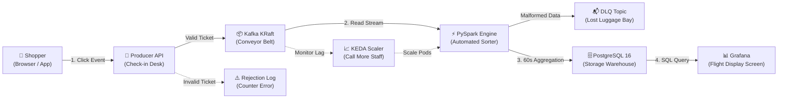

# K.S.C.E.P. Streaming Platform: Complete Guide & Interview Deck

**Project Title:** Kubernetes Stream Clickstream Event Processing (K.S.C.E.P.)  
**Architecture Style:** Event-Driven, Streaming Lakehouse / OLAP  
**Deployment Target:** Local Minikube & Kubernetes 1.28+  

---

## 1. The 30-Second Elevator Pitch

> *"The K.S.C.E.P. Platform is an enterprise-grade, real-time data streaming platform built entirely on Kubernetes. It ingests thousands of e-commerce clickstream events per second, enforces strict schema governance, processes sliding-window user metrics with sub-second latency using Apache Spark, guarantees zero data loss via Kafka-based Dead Letter Queues, stores metrics in daily-partitioned PostgreSQL, and elastically scales pods based on Kafka queue lag using KEDA. Everything is declared as Infrastructure as Code with Terraform and protected by Zero-Trust Network Policies."*

---

## 2. How to Explain the Architecture in Simple Terms

Imagine an **Airport Baggage Handling System**:



1. **The Check-in Desk (Producer API):** Shoppers click on products. The Flask Producer checks if each event has a valid format (Schema Governance). If valid, it places it on the conveyor belt.
2. **The High-Speed Conveyor Belt (Kafka KRaft):** Buffers millions of events in order across 6 partitions with SASL security so nothing is lost even if downstream systems slow down.
3. **The Automated Sorter (PySpark):** Reads events in microbatches, groups them into 60-second sliding windows, calculates active shoppers and cart abandonment rates, and routes any corrupted data to a Dead Letter Queue (DLQ).
4. **The Warehouse (PostgreSQL 16):** Stores the computed analytics in daily partitioned tables so queries remain lightning-fast regardless of data volume.
5. **The Flight Display Screen (Grafana):** Business executives and SREs view live real-time metrics updated every 5 seconds.
6. **The Reserve Staff (KEDA):** Constantly monitors the conveyor belt. If too many bags pile up (consumer lag > 50), KEDA immediately boots up additional Spark worker pods to clear the queue.

---

## 3. Step-by-Step Hands-On Testing Guide

### Step 1: Start Your Kubernetes Cluster
Open PowerShell or Terminal:
```powershell
minikube start --cpus=2 --memory=4096mb --driver=docker
```

### Step 2: Deploy the Entire Infrastructure
Deploy all 8 modules (Kafka, Spark, Postgres, Grafana, KEDA, Monitoring) with one command:
```powershell
cd "terraform/envs/dev"
terraform init
terraform apply -auto-approve
```
*Wait 2 minutes for all pods to show `Running`:*
```powershell
kubectl get pods -n clickstream-pipeline
kubectl get pods -n monitoring
```

---

### Step 3: Open the Traffic Control Panel
Forward the producer port to your machine:
```powershell
kubectl port-forward svc/producer -n clickstream-pipeline 8080:8080
```
- Open your browser to **`http://localhost:8080`**.
- Fetch the Admin API Key to unlock the control panel:
  ```powershell
  kubectl get secret producer-secrets -n clickstream-pipeline -o jsonpath="{.data.admin-api-key}" | [System.Text.Encoding]::UTF8.GetString([System.Convert]::FromBase64String($input))
  ```
- Click **"Start Simulator"** with pattern **"Spike"** or **"Steady"**. You will see events stream into the platform!

---

### Step 4: Verify Stream Processing in PostgreSQL
Check that PySpark is writing sliding-window metrics into the database:
```powershell
$PG_PASS = (kubectl get secret postgres-secrets -n clickstream-pipeline -o jsonpath="{.data.spark-writer-password}" | [System.Text.Encoding]::UTF8.GetString([System.Convert]::FromBase64String($input)))

kubectl exec -it postgres-0 -n clickstream-pipeline -- env PGPASSWORD=$PG_PASS psql -U spark_writer -d clickstream -c "SELECT window_start, page_url, active_users, cart_additions, purchases FROM windowed_user_metrics ORDER BY updated_at DESC LIMIT 5;"
```

---

### Step 5: Test Dead Letter Queue (Poison Pill Test)
Send a malformed payload and prove the platform isolates it safely:
```powershell
curl -X POST http://localhost:8080/api/events `
  -H "Content-Type: application/json" `
  -H "X-API-Key: YOUR_API_KEY" `
  -d '{"schema_version":"99.0","bad_field":true}'
```
Inspect Spark logs to see the rejection and DLQ publication:
```powershell
kubectl logs -n clickstream-pipeline -l app=spark --tail=30
```

---

### Step 6: Trigger Autoscaling Under Heavy Load
Launch the in-cluster Locust load test:
```powershell
kubectl apply -f "tests/load/k8s-locust-job.yaml"
```
Watch KEDA detect the queue build-up and scale Spark pods:
```powershell
kubectl get scaledobject -n clickstream-pipeline -w
kubectl get pods -n clickstream-pipeline -l app=spark -w
```

---

### Step 7: Open the Grafana Live Dashboards
```powershell
kubectl port-forward svc/grafana -n monitoring 3000:3000
```
- Open **`http://localhost:3000`** (User: `admin`).
- Fetch the password:
  ```powershell
  kubectl get secret grafana-secrets -n monitoring -o jsonpath="{.data.admin-password}" | [System.Text.Encoding]::UTF8.GetString([System.Convert]::FromBase64String($input))
  ```
- Click on **Dashboards**:
  1. **Executive:** Revenue, Cart Abandonment Rate, Active Users.
  2. **Engineering:** Events/sec, DLQ Rejections, Microbatch Durations.
  3. **Infra/Ops:** Pod CPU/Memory, KEDA Scaling Events.

---

## 4. The 5-Minute Live Interview Demo Script

| Time | What to Show on Screen | What to Say to the Interviewer |
| :--- | :--- | :--- |
| **0:00 - 1:00** | Architecture Diagram | *"I built an end-to-end streaming data platform on Kubernetes following production Zero-Trust and GitOps principles. Here is the data journey from HTTP ingestion to live Grafana dashboards."* |
| **1:00 - 2:00** | Producer Web UI (`:8080`) | *"Here is our schema-governed Producer. Notice we can simulate traffic patterns like steady load or sudden traffic spikes. It validates every event against a strict JSON Schema v1 before sending to Kafka."* |
| **2:00 - 3:00** | Terminal (`kubectl logs` / `psql`) | *"Here is our Spark Structured Streaming job in action. It calculates 60-second sliding windows with a 2-minute watermark. Notice how records are upserted idempotently into PostgreSQL using `ON CONFLICT DO UPDATE` so restarts never duplicate records."* |
| **3:00 - 4:00** | Locust Load Test + KEDA | *"Now watch what happens when traffic spikes. Standard Kubernetes HPA relies on CPU metrics, which react too late. We use KEDA to monitor Kafka topic lag directly. The moment lag crosses 50 messages, KEDA scales consumer replicas."* |
| **4:00 - 5:00** | Grafana Dashboards (`:3000`) | *"Finally, business teams view the Executive dashboard for cart conversions, while SREs monitor the Infra/Ops dashboard for pod health, DLQ rate, and cluster saturation."* |

---

## 5. Interview Q&A Cheatsheet (Tough Technical Questions)

### Q1: Why Kafka KRaft instead of ZooKeeper?
> **Answer:** *"KRaft (Kafka Raft Metadata mode) eliminates the external ZooKeeper dependency. It runs consensus directly inside Kafka, reducing cluster memory footprint by 40%, simplifying operational management, and accelerating controller failover from minutes to milliseconds."*

### Q2: How do you guarantee Exactly-Once Semantics (EOS)?
> **Answer:** *"We achieve end-to-end exactly-once processing through three mechanisms: First, Spark Structured Streaming maintains state and offset commits in durable PVC checkpoints. Second, late data arriving beyond 2 minutes is handled via explicit watermarking. Third, our PostgreSQL sink uses atomic idempotent upserts (`INSERT ... ON CONFLICT (window_start, window_end, page_url) DO UPDATE`). Even if a microbatch re-executes, database values are updated rather than duplicated."*

### Q3: Why KEDA instead of standard Kubernetes HPA?
> **Answer:** *"Standard HPA monitors CPU or memory utilization. In streaming workloads, CPU is a lagging indicator—by the time CPU spikes, thousands of messages are already backlogged. KEDA connects directly to Kafka brokers via SASL, computes the true consumer group lag (`Topic end offset - committed offset`), and proactively scales pods before latency degrades."*

### Q4: How is security handled (Zero-Trust)?
> **Answer:** *"Every namespace (`clickstream-pipeline`, `monitoring`, `keda`) has a `default-deny-all` NetworkPolicy. Pods can only talk to explicitly whitelisted endpoints and ports. Containers run as non-root UIDs (e.g. Spark UID 1000, Postgres UID 70) with all Linux capabilities dropped and privilege escalation disabled. All passwords are cryptographically generated by Terraform with zero plaintext secrets in Git, guarded by Gitleaks and Trivy CI gates."*

### Q5: How is PostgreSQL optimized for streaming analytical writes?
> **Answer:** *"PostgreSQL 16 is configured with declarative range partitioning by day on `window_start`. Daily maintenance CronJobs automatically create tomorrow's partition in advance. This prevents table bloat, enables partition pruning during Grafana queries, and allows instant archiving of old data via `DROP TABLE` instead of expensive vacuum operations."*
